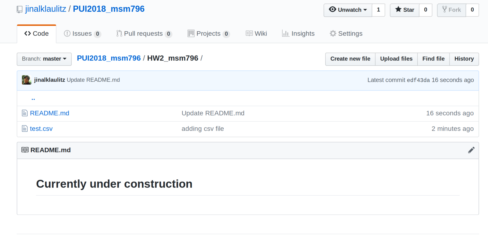
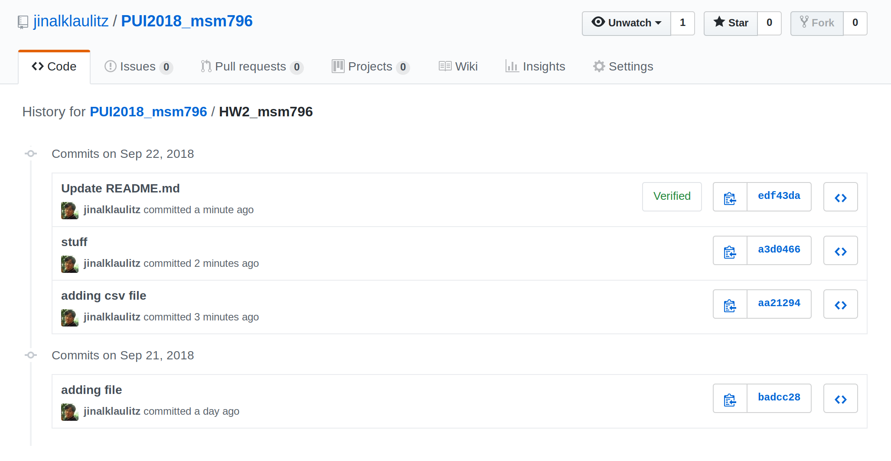
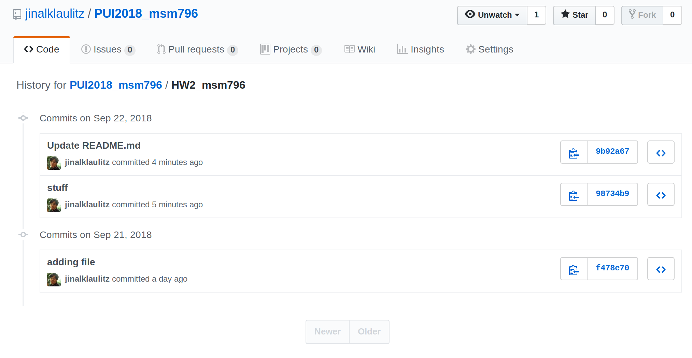
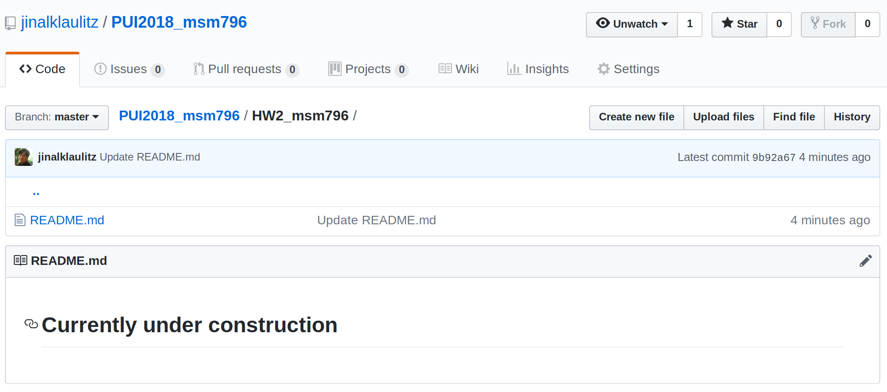

# Homework 3
###### Entirely done by Marvin Mananghaya (MSM796) - under construction
###### Assisted Yushi Chen (YC3763) in her assignment 4.
###### Provided quality assurance checks to Sung Hoog Yang (SHY256) and Manrique Vargas (MV1742)
-------------------------------------------------------------------------------------------
### Assignment 1
###### (note: folder was renamed from hw2_msm796 to hw3_msm796)
1.) I created a test.csv file, as shown in the picture.

2.) Here shown is the folder's history.

3.) This shows the current repository after forcefully deleting the test.csv file
the following code was executed to delete the file:
```
git filter-branch --force --index-filter 'git rm --cached --ignore-unmatch ./HW2_msm796/test.csv' --prune-empty --tag-name-filter cat -- --all
```

4.) The folder's history is shown as follows.


### Assignment 2
I used the Socrata's reccomended Python API Package - sodapy
(url: https://dev.socrata.com/foundry/data.cityofnewyork.us/2yzn-sicd)
